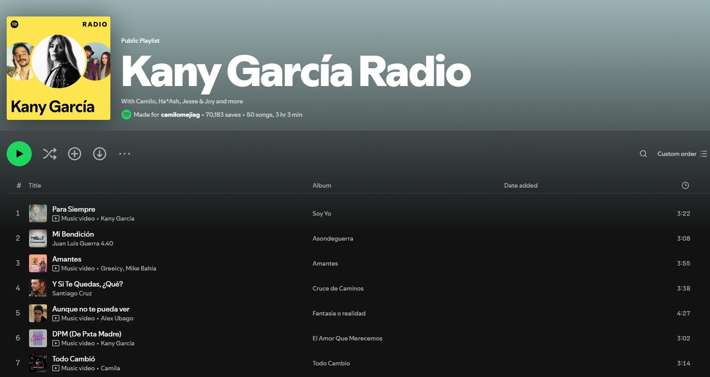

This is a [Next.js](https://nextjs.org) project bootstrapped with [`create-next-app`](https://nextjs.org/docs/app/api-reference/cli/create-next-app).

## Getting Started

First, run the development server:

```bash
npm run dev
# or
yarn dev
# or
pnpm dev
# or
bun dev
```

Open [http://localhost:3000](http://localhost:3000) with your browser to see the result.

You can start editing the page by modifying `app/page.tsx`. The page auto-updates as you edit the file.

This project uses [`next/font`](https://nextjs.org/docs/app/building-your-application/optimizing/fonts) to automatically optimize and load [Geist](https://vercel.com/font), a new font family for Vercel.

# Spotify Feed and Playlist Constructor

## Project Overview
This project is designed to construct a Spotify feed and playlist using the Spotify API..

## Criteria to meet
1. Fork this project into your own Github space.
2. Authenticate with your Spotify account and get an API key
    - Follow this documentation: https://developer.spotify.com/documentation/web-api
3. Build a homepage which shows a feed with playlists (it can show any you want. Playlists, artists, genres, etc)

4. When clicking an option on the feed, it should redirect you to a separate view which includes the list of songs related to the playlist.
    - Both views should be created using the Router.

5. When finished, create a Pull Request from your own domain to the [main project](https://github.com/camilomejiag/intervew-test). 